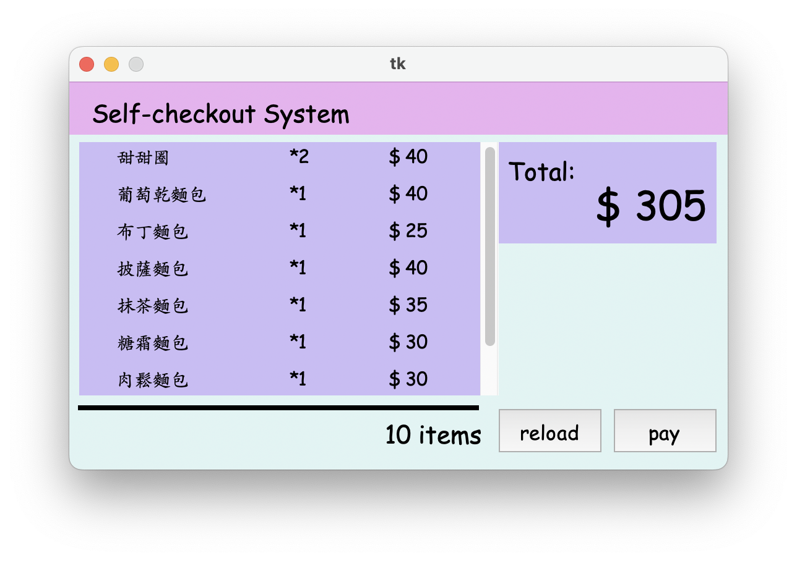
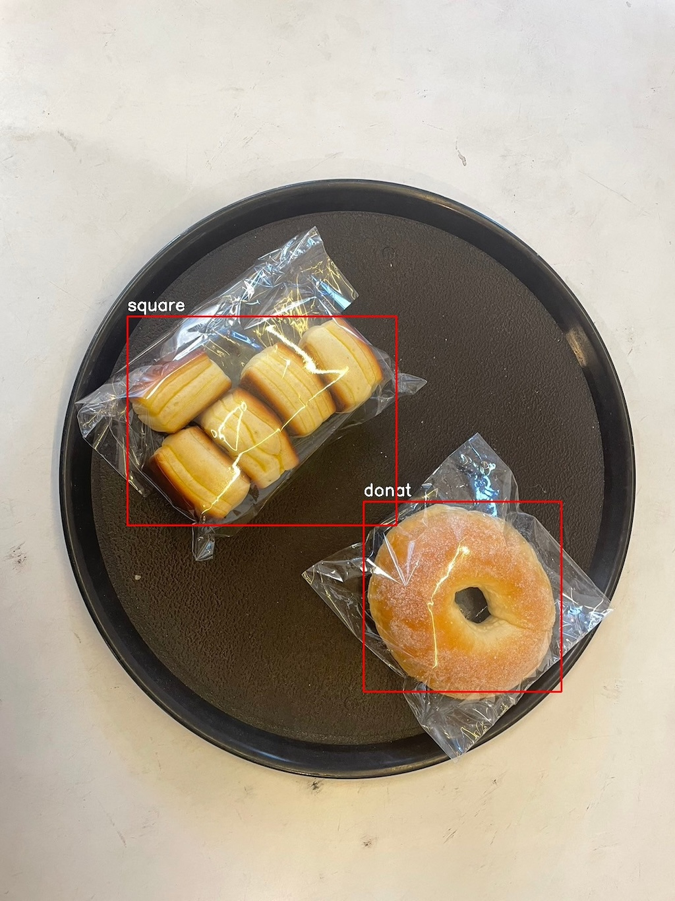
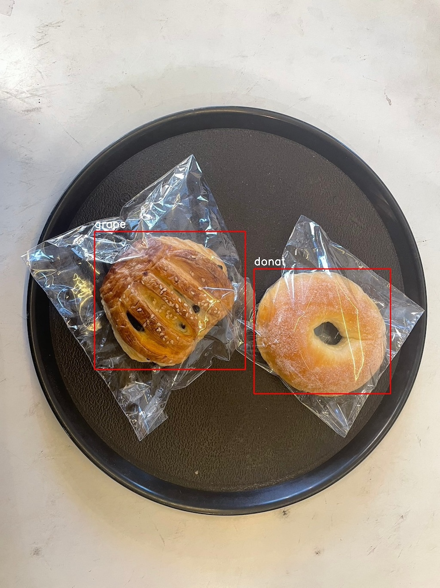
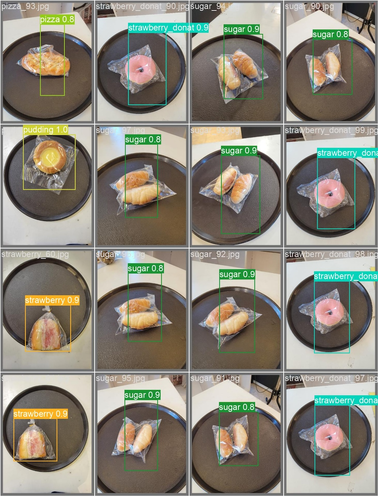
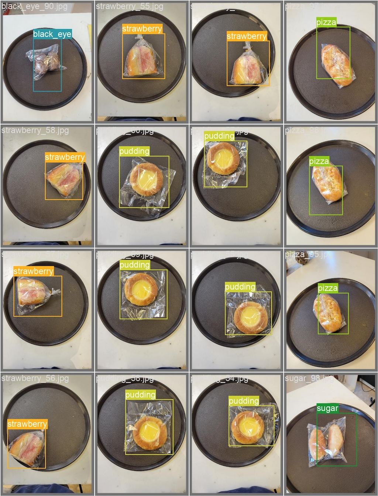

# Automatic Checkout System
Automatic Checkout System is an efficient system that can scan all items using a camera at once in just one second and calculate the total prices.

 The system includes three hardware equipment: a camera (capture images), a computer (object detection), and a screen (run self-programmed GUI to display the output for users to pay).

## Demo


## Requirements
```
pip install numpy opencv-python Pillow ultralytics
```

## Run
1. Install **[IP WebCam](https://play.google.com/store/apps/details?id=com.pas.webcam&hl=en_US)** on your phone and open it.
2. Change the `ip_webcam_url` in `yolo_camera.py` to your ip in the bottom of WebCam app.
3. Run `yolo_camera.py`.
```
python yolo_camera.py
```
4. Run `gui_coloered_and_paid.py`
```
python gui_coloered_and_paid.py
```

## Training
We use a **[self-labeded bread data](https://drive.google.com/file/d/1WqACSIUyiVGtW89GkAsSmXuvE4T4sLqE/view?usp=sharing)** of bread images to train the **[YOLOv8 model](https://github.com/ultralytics/ultralytics)**. All of the bread images were collected from the first floor of 風雲樓.

**Validation Results:**
|||
|-|-|
|||
|||

## Data
Our **[self-labeded bread data](https://drive.google.com/file/d/1WqACSIUyiVGtW89GkAsSmXuvE4T4sLqE/view?usp=sharing)** contains 11 types of bread.
- donat (甜甜圈)
- grape (葡萄乾麵包)
- square (大理石磚麵包)
- strawberry (草莓麵包)
- pudding (布丁麵包)
- meat floss (肉鬆麵包)
- pizza (披薩麵包)
- matcha (抹茶麵包)
- sugar (糖霜麵包)
- strawberry donat (草莓甜甜圈)
- black eye (黑岩豆豆麵包)

According to the requirements of YOLOv8, the data were divided into three sets: train, valid, and test.